# Flask CI/CD Pipeline with Docker, Amazon ECR, GitHub Actions and AWS EC2

## Project Overview

This project demonstrates an end-to-end **CI/CD pipeline for a Flask Student Registration System**.

The application is a Flask web application that manages student records using MongoDB. The DevOps implementation automates testing, Docker image creation, image publishing to Amazon Elastic Container Registry (Amazon ECR), and deployment to an Amazon EC2 instance using **AWS Systems Manager (SSM)**.

The final solution demonstrates the following DevOps practices:

- Source-code management with Git and GitHub
- Automated testing with GitHub Actions
- Python 3.12 CI environment
- MongoDB service for CI testing
- Docker containerization
- Amazon ECR image storage
- GitHub Actions OIDC authentication with AWS IAM
- Least-privilege IAM roles
- Automated EC2 deployment using AWS Systems Manager
- Docker restart policy for application resilience
- Application health verification
- Deployment verification through browser, Docker and AWS console evidence

---

## 1. Project Information

| Item | Details |
|---|---|
| Application | Student Registration System |
| Backend | Python / Flask |
| Database | MongoDB |
| Frontend | HTML / Jinja2 / Bootstrap 5 |
| Containerization | Docker |
| Source Control | Git / GitHub |
| CI/CD | GitHub Actions |
| Container Registry | Amazon ECR |
| Compute | Amazon EC2 |
| Deployment | AWS Systems Manager (SSM) |
| AWS Region | `us-east-1` |
| EC2 Instance Type | `t3.micro` |
| Application Port | `5000` |
| ECR Repository | `flask-practice` |
| Container Name | `flask-practice` |
| CI Python Version | `3.12` |

---

## 2. GitHub Repository

**Repository:**  
https://github.com/aeupsc-png/flask_Practice

The repository contains the Flask application, Docker configuration, tests, templates, environment-variable example, and GitHub Actions workflow.

Important project files include:

```text
flask_Practice/
├── .github/
│   └── workflows/
│       ├── flask-ci-cd.yml
│       ├── securegate.yml
│       └── securegate-summary.yaml
├── templates/
├── .dockerignore
├── .env.example
├── .gitignore
├── Dockerfile
├── LICENSE
├── README.md
├── README.pdf
├── app.py
├── requirements.txt
├── start_flask.sh
└── test_app.py
```

> **Security note:** The real `.env` file and private credentials are intentionally not committed to GitHub. Only `.env.example` should be stored in the repository.

---

## 3. Application Description

The project is a Student Registration System.

### Main features

- View registered students
- Add a student
- Edit student details
- Delete a student
- MongoDB-backed student records
- Bootstrap-based responsive interface

The application was successfully verified after deployment using the browser and local EC2/container testing.

---

## 4. Technology Stack

### Application

- Python
- Flask
- Flask-PyMongo
- Jinja2
- Bootstrap 5
- MongoDB

### DevOps

- Git
- GitHub
- GitHub Actions
- Docker
- Amazon ECR
- Amazon EC2
- AWS Systems Manager
- AWS IAM
- GitHub OIDC

---

# 5. Architecture

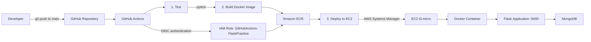

### Deployment flow

```text
Git push
   ↓
GitHub Actions
   ↓
Test Flask application
   ↓
Build Docker image
   ↓
Authenticate to AWS using GitHub OIDC
   ↓
Push Docker image to Amazon ECR
   ↓
AWS Systems Manager sends deployment command to EC2
   ↓
EC2 pulls latest Docker image
   ↓
Old container is removed
   ↓
New container starts with --restart unless-stopped
   ↓
Flask application available on port 5000
```

---

# 6. CI/CD Workflow

The workflow file is:

```text
.github/workflows/flask-ci-cd.yml
```

The workflow runs automatically when code is pushed to the `main` branch.

## Pipeline stages

### Stage 1 – Test

The workflow:

1. Checks out the source code.
2. Uses Python 3.12.
3. Starts a MongoDB 7 service container for CI.
4. Installs application dependencies.
5. Installs pytest.
6. Runs the automated test suite.

The MongoDB CI connection is isolated from the production database.

Example CI database:

```text
mongodb://127.0.0.1:27017/test_student_db
```

---

### Stage 2 – Build and Push Docker Image

After tests pass:

1. GitHub Actions authenticates to AWS using OIDC.
2. The `GitHubActions-FlaskPractice` IAM role is assumed.
3. GitHub Actions logs in to Amazon ECR.
4. The Docker image is built.
5. The image is tagged using the Git commit SHA.
6. The image is also tagged as `latest`.
7. Both image tags are pushed to Amazon ECR.

This provides traceability because the commit SHA identifies the exact source version associated with the image.

---

### Stage 3 – Deploy to EC2 Using AWS Systems Manager

After the Docker image is successfully pushed:

1. GitHub Actions configures AWS credentials.
2. AWS Systems Manager `send-command` is used.
3. The command targets the EC2 instance.
4. EC2 logs in to Amazon ECR.
5. EC2 pulls the `latest` Docker image.
6. Any existing `flask-practice` container is removed.
7. A new container is started.
8. Port `5000` is mapped from EC2 to the Docker container.
9. The container uses the production `.env` file stored on the EC2 instance.
10. The container uses:

```text
--restart unless-stopped
```

This allows Docker to automatically restart the application container if it stops unexpectedly or after a Docker daemon restart.

---

# 7. AWS Resources

## 7.1 Amazon ECR

ECR repository:

```text
flask-practice
```

Region:

```text
us-east-1
```

The repository contains successfully pushed Docker images.

The final evidence screenshot shows the ECR repository with multiple images, including the `latest` image.

---

## 7.2 Amazon EC2

The application is deployed to an EC2 instance with:

```text
Instance type: t3.micro
Application port: 5000
Operating system: Amazon Linux 2023
```

The instance was verified as:

```text
Running
3/3 status checks passed
```

---

# 8. IAM and Security

## 8.1 GitHub Actions IAM Role

Role:

```text
GitHubActions-FlaskPractice
```

Purpose:

- Allow GitHub Actions to authenticate to AWS using OIDC.
- Allow the CI/CD workflow to perform the AWS operations required by the pipeline.
- Avoid storing long-lived AWS access keys in GitHub.

The workflow has:

```yaml
permissions:
  contents: read
  id-token: write
```

The `id-token: write` permission is required for GitHub Actions OIDC authentication.

---

## 8.2 EC2 IAM Role

Role:

```text
FlaskPracticeEC2Role
```

The role is attached to the EC2 instance.

The configured AWS-managed permissions shown in the implementation are:

- `AmazonEC2ContainerRegistryReadOnly`
- `AmazonSSMManagedInstanceCore`

### Purpose

`AmazonEC2ContainerRegistryReadOnly` allows the EC2 instance to authenticate to and pull container images from ECR.

`AmazonSSMManagedInstanceCore` allows AWS Systems Manager to manage the EC2 instance and execute commands remotely.

This avoids requiring GitHub Actions to open a separate direct SSH deployment path.

---

# 9. GitHub Actions OIDC

The pipeline uses GitHub Actions OIDC rather than storing permanent AWS access keys.

The workflow uses the AWS credentials action and assumes:

```text
GitHubActions-FlaskPractice
```

This provides a more secure authentication model for CI/CD.

High-level authentication flow:

```text
GitHub Actions
      ↓
GitHub OIDC token
      ↓
AWS IAM trust relationship
      ↓
GitHubActions-FlaskPractice role
      ↓
Temporary AWS permissions
```

No AWS access key or secret access key is required for the GitHub Actions authentication flow.

---

# 10. Docker Configuration

The application is containerized using the project `Dockerfile`.

The container exposes:

```text
5000
```

The EC2 deployment maps:

```text
EC2 port 5000 → Container port 5000
```

The production container is started with:

```bash
docker run -d \
  --restart unless-stopped \
  --name flask-practice \
  --env-file /home/ec2-user/flask_Practice/.env \
  -p 5000:5000 \
  <ECR_IMAGE>
```

---

# 11. Deployment Verification

The deployment was verified at multiple levels.

## 11.1 GitHub Actions

The final successful workflow shows:

```text
1. Test                  ✓
2. Build and Push        ✓
3. Deploy to EC2         ✓
```

This confirms that the CI/CD workflow completed successfully.

---

## 11.2 Amazon ECR

The ECR repository was checked and confirmed to contain successfully pushed Docker images.

The image was also verified using the AWS CLI:

```bash
aws ecr describe-images \
  --repository-name flask-practice \
  --region us-east-1
```

---

## 11.3 Docker

The EC2 server was checked using:

```bash
docker ps
```

The running container was confirmed as:

```text
flask-practice
```

with port mapping:

```text
0.0.0.0:5000->5000/tcp
```

---

## 11.4 Flask Logs

The Docker logs confirmed:

- Flask application started successfully.
- Flask listened on port 5000.
- HTTP requests were received.
- The application returned successful HTTP responses.

Example verification:

```bash
docker logs --tail 30 flask-practice
```

---

## 11.5 Browser Verification

The deployed application was opened through the EC2 public address using:

```text
http://<EC2-PUBLIC-IP>:5000
```

The **Student Registration System** page was displayed successfully.

A student record was also visible in the application:

```text
Name: Hrudav
Email: devops@test.com
Course: Cloud DevOps
```

This confirms that the final deployed application was accessible and functioning.

---

# 12. Evidence / Screenshots

The following **10 screenshots** are the recommended final evidence set. Older failed/debug workflow screenshots are intentionally excluded from the final submission.

Create/use:

```text
docs/screenshots/
```

| No. | File | Evidence |
|---:|---|---|
| 1 | `01-github-code-page.png` | GitHub repository Code page and project files |
| 2 | `02-github-actions-successful-pipeline.png` | Successful Test → Build/Push → Deploy workflow |
| 3 | `03-ecr-images.png` | Amazon ECR repository and pushed images |
| 4 | `04-ecr-cli-verification.png` | AWS CLI ECR image verification |
| 5 | `05-ec2-running-and-role-attached.png` | EC2 t3.micro, status checks and IAM attachment evidence |
| 6 | `06-github-actions-iam-role.png` | GitHub Actions IAM role and permissions |
| 7 | `07-ec2-iam-role.png` | EC2 IAM role with ECR and SSM permissions |
| 8 | `08-docker-container-running.png` | Running `flask-practice` Docker container |
| 9 | `09-docker-flask-logs.png` | Flask/Docker logs and successful HTTP requests |
| 10 | `10-final-application.png` | Student Registration System running in the browser |

## Screenshot 1 – GitHub Repository

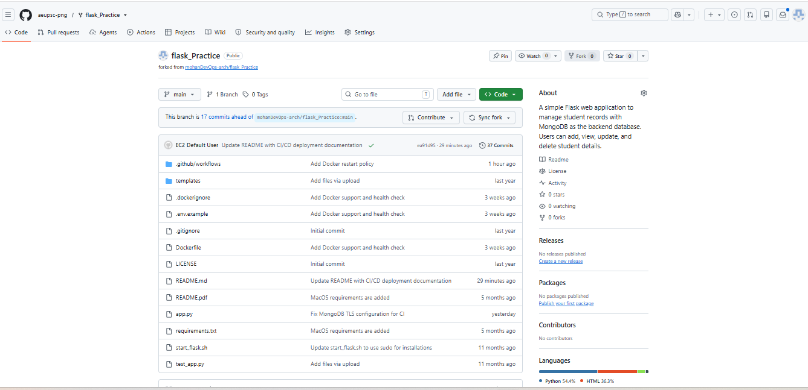

Shows the repository Code page, workflow directory, Dockerfile, application code, tests and documentation.

## Screenshot 2 – Successful CI/CD Pipeline

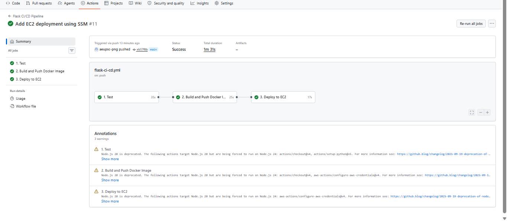

Shows the successful final pipeline with Test, Build/Push and Deploy stages completed.

## Screenshot 3 – Amazon ECR

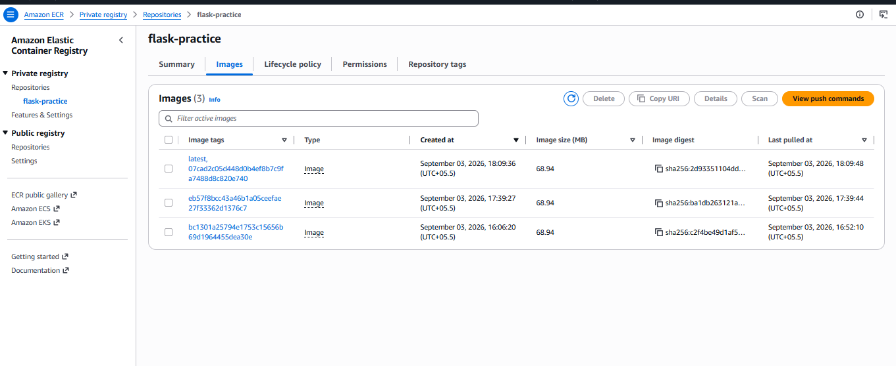

Shows Docker images stored in the `flask-practice` ECR repository.

## Screenshot 4 – ECR CLI Verification

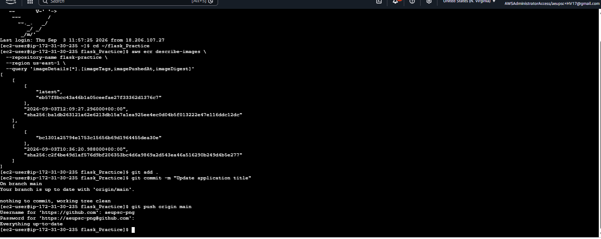

Shows AWS CLI verification of images in the ECR repository.

## Screenshot 5 – EC2 and IAM Role Attachment

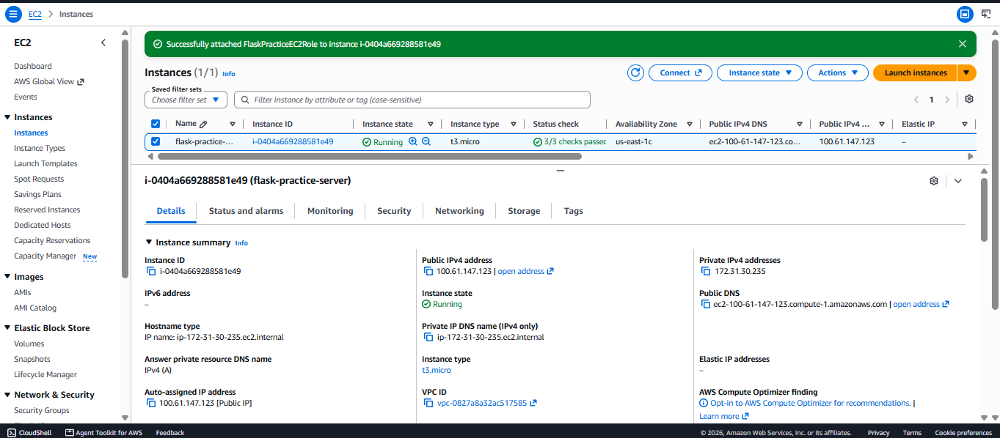

Shows the running EC2 instance, successful status checks and the IAM role attachment evidence.

## Screenshot 6 – GitHub Actions IAM Role

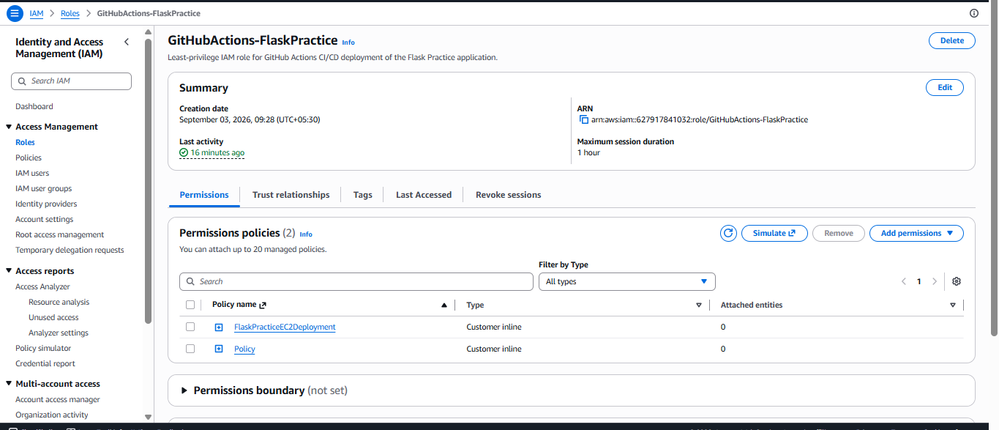

Shows the `GitHubActions-FlaskPractice` role and its configured policies.

## Screenshot 7 – EC2 IAM Role

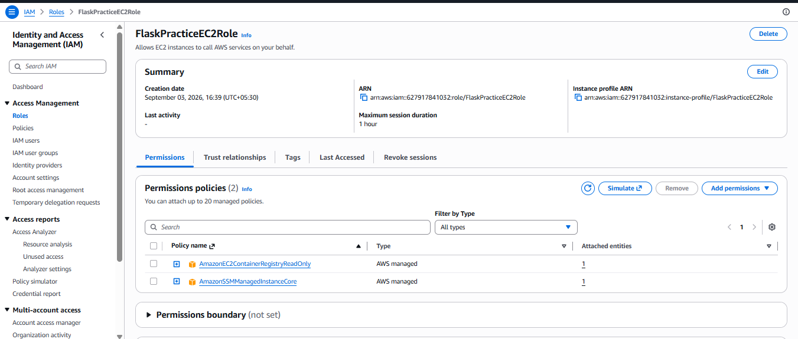

Shows the `FlaskPracticeEC2Role` with ECR read-only and SSM managed-instance permissions.

## Screenshot 8 – Running Docker Container

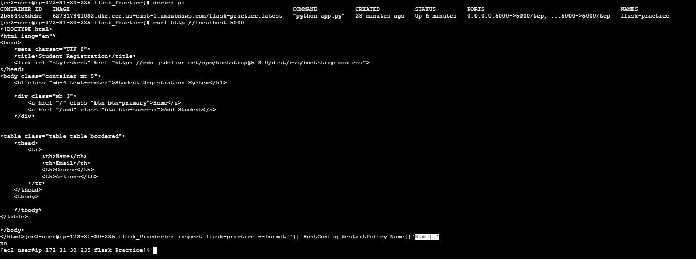

Shows the running `flask-practice` container and port `5000`.

## Screenshot 9 – Docker/Flask Logs

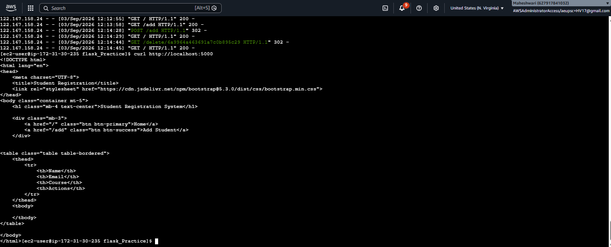

Shows Flask startup and successful HTTP requests.

## Screenshot 10 – Final Application

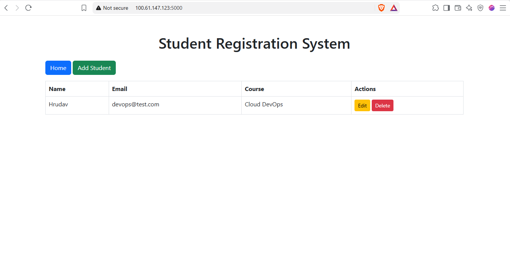

Shows the deployed Student Registration System working in the browser.

---

# 13. CI/CD Evidence Summary

| Requirement | Implementation | Evidence |
|---|---|---|
| Source control | GitHub | Repository screenshot |
| Automated CI | GitHub Actions | Successful workflow |
| Python testing | pytest | Test stage |
| Python version | Python 3.12 | Workflow |
| MongoDB CI testing | MongoDB 7 service | Test stage |
| Containerization | Docker | Dockerfile + Docker screenshot |
| Image registry | Amazon ECR | ECR screenshot |
| Secure AWS authentication | GitHub OIDC | IAM/workflow |
| AWS IAM | GitHub Actions role | IAM screenshot |
| EC2 permissions | ECR ReadOnly + SSM Core | IAM screenshot |
| Compute | EC2 t3.micro | EC2 screenshot |
| Deployment | AWS Systems Manager | Workflow/deployment evidence |
| Container restart policy | `unless-stopped` | Deployment configuration |
| Application port | 5000 | Docker/browser evidence |
| Deployment verification | Docker + Flask + browser | Final screenshots |

---

# 14. Testing

The CI pipeline runs automated tests before building and deploying the application.

Command used by CI:

```bash
pytest -q
```

The Docker image is only built after the test stage succeeds.

This provides the following quality gate:

```text
Tests pass
   ↓
Docker build
   ↓
ECR push
   ↓
EC2 deployment
```

This prevents a failed test stage from continuing into the deployment stages.

---

# 15. Important Environment Configuration

The production MongoDB URI and secret values are stored on the EC2 instance in:

```text
/home/ec2-user/flask_Practice/.env
```

The `.env` file is not committed to GitHub.

The repository contains:

```text
.env.example
```

as a safe template.

Example:

```env
MONGO_URI=<your-mongodb-connection-string>
SECRET_KEY=<your-secret-key>
```

Never commit real passwords, MongoDB credentials, AWS secret keys, SSH private keys or other secrets.

---

# 16. How to Reproduce the Deployment

## Step 1 – Clone the repository

```bash
git clone https://github.com/aeupsc-png/flask_Practice.git
cd flask_Practice
```

## Step 2 – Configure application environment

Create `.env` with the required MongoDB connection string and secret key.

## Step 3 – Test locally

Install dependencies:

```bash
pip install -r requirements.txt
```

Run tests:

```bash
pytest -q
```

## Step 4 – Build Docker image

```bash
docker build -t flask-practice .
```

## Step 5 – Run Docker container

```bash
docker run -d \
  --name flask-practice \
  --restart unless-stopped \
  --env-file .env \
  -p 5000:5000 \
  flask-practice
```

## Step 6 – Verify

```bash
docker ps
```

Then open:

```text
http://localhost:5000
```

## Step 7 – Push changes

```bash
git add .
git commit -m "Update CI/CD documentation"
git push origin main
```

The GitHub Actions workflow then performs the automated CI/CD process.

---

# 17. Troubleshooting Performed During Development

During implementation, several CI/CD configuration problems were investigated and corrected.

The final implementation successfully achieved:

- Working GitHub Actions workflow
- Working OIDC authentication
- Successful Docker build
- Successful ECR push
- Successful EC2 deployment
- Working Docker container
- Working Flask application
- Successful browser verification

Older failed/debug workflow runs are intentionally not presented as final evidence because the submission should demonstrate the completed working implementation.

---

# 18. Final Result

The project successfully demonstrates a complete automated deployment pipeline:

```text
Developer
   ↓
GitHub
   ↓
GitHub Actions
   ↓
Automated Tests
   ↓
Docker Build
   ↓
Amazon ECR
   ↓
AWS Systems Manager
   ↓
Amazon EC2
   ↓
Docker Container
   ↓
Flask Application
   ↓
Student Registration System
```

The final application was successfully deployed to an AWS EC2 `t3.micro` instance and verified through Docker, application logs, AWS services and the browser.

---

# 19. Learning Outcomes / Skills Demonstrated

This project demonstrates practical knowledge of:

1. Git and GitHub
2. GitHub Actions
3. CI/CD pipeline design
4. Automated Python testing
5. Docker image creation
6. Docker container management
7. Amazon ECR
8. Amazon EC2
9. AWS Systems Manager
10. AWS IAM
11. GitHub OIDC authentication
12. Environment-variable management
13. Linux/EC2 command-line operations
14. Application deployment
15. Deployment verification
16. Basic DevOps security practices
17. Container restart policies
18. Infrastructure troubleshooting

---

# 20. Submission Checklist

Before submitting the project, verify every item below.

### GitHub

- [ ] Repository is public/accessible to the evaluator.
- [ ] `README.md` is updated.
- [ ] `.github/workflows/flask-ci-cd.yml` is present.
- [ ] `Dockerfile` is present.
- [ ] `app.py` is present.
- [ ] `requirements.txt` is present.
- [ ] `test_app.py` is present.
- [ ] `templates/` is present.
- [ ] `.env.example` is present.
- [ ] Real `.env` is NOT committed.
- [ ] Screenshots are uploaded under `docs/screenshots/`.
- [ ] Latest GitHub Actions run is successful.

### AWS

- [ ] ECR repository `flask-practice` exists.
- [ ] Docker image is present in ECR.
- [ ] EC2 instance is running.
- [ ] EC2 type is `t3.micro`.
- [ ] EC2 status checks pass.
- [ ] `FlaskPracticeEC2Role` is attached to EC2.
- [ ] ECR read-only permission is available to EC2.
- [ ] SSM managed-instance permission is available to EC2.
- [ ] `GitHubActions-FlaskPractice` IAM role exists.
- [ ] GitHub OIDC trust relationship is configured.
- [ ] GitHub Actions can authenticate to AWS.
- [ ] SSM deployment succeeds.
- [ ] Docker container is running.
- [ ] Port `5000` is reachable.
- [ ] Flask application opens successfully in the browser.

### Final submission

- [ ] GitHub repository link copied correctly.
- [ ] README contains architecture and implementation details.
- [ ] Screenshots clearly show successful implementation.
- [ ] No passwords or private keys are included.
- [ ] No failed/debug screenshots are used as final proof.
- [ ] Final browser screenshot is included.
- [ ] Successful GitHub Actions screenshot is included.
- [ ] ECR screenshot is included.
- [ ] EC2 screenshot is included.
- [ ] IAM screenshots are included.
- [ ] Docker verification screenshot is included.

---

# 21. Repository Link

**GitHub:**  
https://github.com/aeupsc-png/flask_Practice

**Workflow:**  
https://github.com/aeupsc-png/flask_Practice/blob/main/.github/workflows/flask-ci-cd.yml

---

# 22. Conclusion

This project implements a complete Flask CI/CD solution using GitHub Actions and AWS.

A source-code change pushed to the `main` branch triggers automated testing. Once the tests pass, GitHub Actions builds the Docker image and publishes it to Amazon ECR. AWS IAM with GitHub OIDC provides secure AWS authentication, and AWS Systems Manager is used to deploy the latest container image to the EC2 instance.

The deployed Flask application was successfully verified through Docker status, application logs, AWS ECR verification and browser access.

The project therefore demonstrates the practical implementation of **source control, CI/CD, automated testing, Docker, container registry management, AWS IAM, OIDC, EC2, Systems Manager and application deployment** in one end-to-end DevOps workflow.
